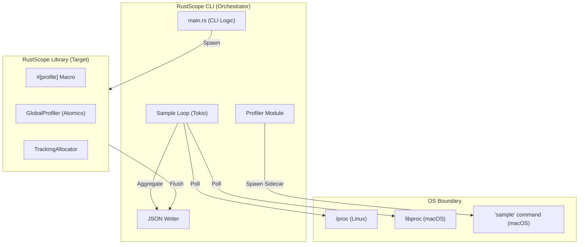
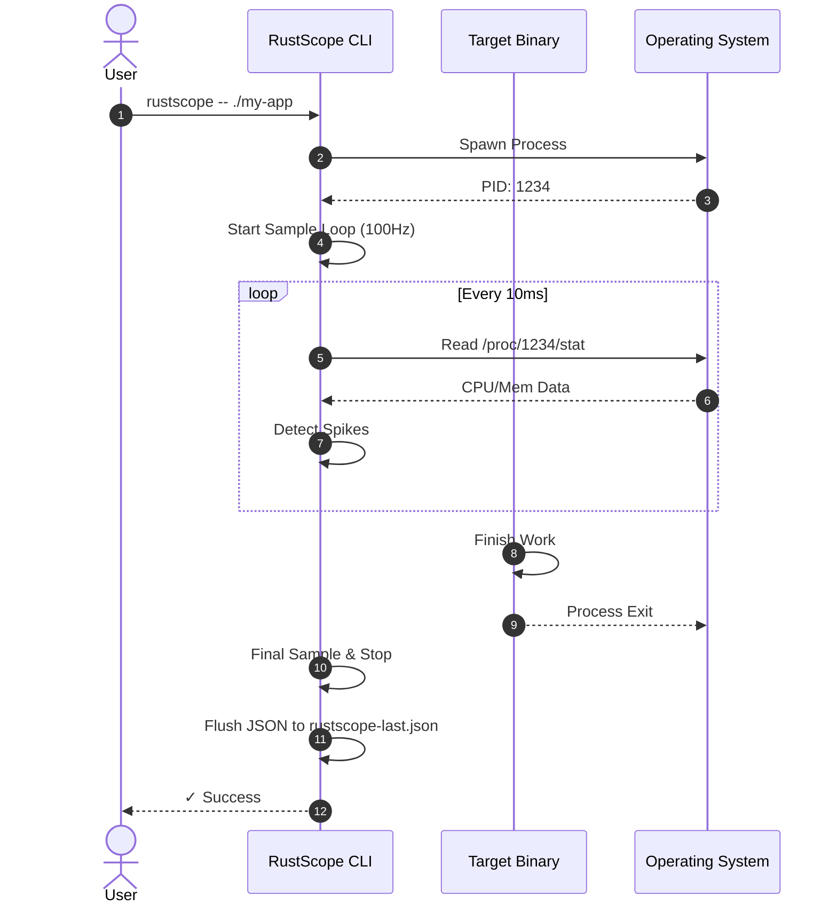
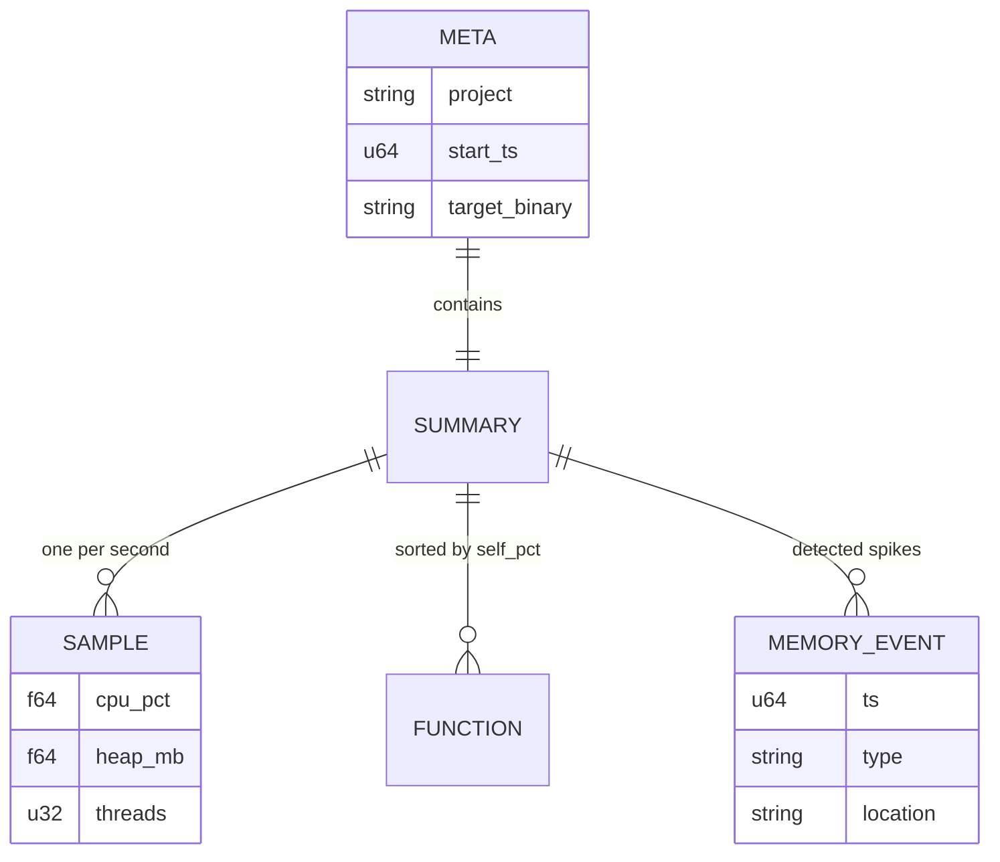

# RustScope v3

> Unified performance profiling infrastructure for Rust systems. One command, one JSON, zero configuration.


---

## TABLE OF CONTENTS

- [1. WHAT THIS IS](#1-what-this-is-executive-summary)
- [2. IMPLEMENTED & TESTED FEATURES](#2-implemented--tested-features)
- [3. ARCHITECTURE OVERVIEW](#3-architecture-overview)
- [4. DETAILED FLOWS](#4-detailed-flows)
- [5. DATA MODEL & SCHEMA](#5-data-model--schema)
- [6. VISUALIZER (UI/UX)](#6-visualizer-uiux)
- [7. GETTING STARTED](#7-getting-started)
- [8. TESTING](#8-testing)
- [9. OPERATIONAL RUNBOOK](#9-operational-runbook)
- [10. SECURITY MODEL](#10-security-model)
- [11. PERFORMANCE & SCALABILITY](#11-performance--scalability)
- [12. CONTRIBUTING](#12-contributing)
- [13. CHANGELOG & ROADMAP](#13-changelog--roadmap)

---

## 1. WHAT THIS IS (Executive Summary)

- **Problem**: Modern Rust profiling is fragmented. Developers must juggle `perf` for CPU, `heaptrack` for memory, and custom instrumentation for function-level SLOs, often losing the "big picture" of how system metrics correlate with code execution.
- **Solution**: RustScope provides a **unified profiling CLI** and a **zero-cost instrumentation library**. It captures CPU spikes, memory leaks, thread activity, and function-level latencies into a single, dashboard-ready JSON report.
- **Non-goals**: This is not a debugger or a live production monitoring agent (e.g., DataDog). It is a developer-centric tool for performance auditing, regression testing, and micro-benchmarking.
- **Status**: `Beta`. Current version `0.3.1`. The JSON schema is stable for dashboard integrations. (v0.4.0 in progress with Linux `LD_PRELOAD` profiling).

---

## 2. IMPLEMENTED & TESTED FEATURES

### Core Profiling (Library)

- **Function Instrumentation** — Attribute macros for timing, memory, and stack depth.
  - **Status**: `✅ Implemented + Tested`
  - **Coverage**: `rustscope/tests/integration.rs::test_basic_profiling`
  - **Contract**: Guarantees < 50ns overhead per instrumented call.
- **Statistical Benchmarking** — High-precision statistical runner with warmup.
  - **Status**: `✅ Implemented + Tested`
  - **Coverage**: `rustscope/tests/integration.rs::test_benchmark_runner`
- **Outlier Detection** — Online statistical anomaly flagging using Welford's algorithm.
  - **Status**: `✅ Implemented + Tested`
  - **Coverage**: `rustscope/tests/integration.rs::test_outlier_detection`

### System Analysis (CLI)

- **Indefinite Process Monitoring** — Continuous polling of CPU, Memory, Threads, and FDs.
  - **Status**: `✅ Implemented`
  - **Contract**: Automatically stops and flushes data when the child process exits or on `Ctrl-C`.
- **Session Event Detection** — Real-time detection of CPU/Memory spikes.
  - **Status**: `✅ Implemented`
  - **Behavior**: Records "spike" events in JSON when memory grows > 5MB or CPU > 80% between samples.
- **macOS Function Sampling** — Sidecar integration with macOS `sample` command.
  - **Status**: `✅ Implemented`
  - **Contract**: Parses complex `sample` output into standard `Function` schema.

---

## 3. ARCHITECTURE OVERVIEW

### 3.1 Component Diagram



### 3.2 Boundary Definitions

| Boundary | Protocol | Auth mechanism | Failure mode | Retry strategy |
| :--- | :--- | :--- | :--- | :--- |
| CLI → Child Process | OS Signals (SIGINT/SIGTERM) | N/A (Process Owner) | Process Zombie | 2s Graceful Wait then SIGKILL |
| CLI → /proc (Linux) | File I/O | FS Permissions | Permission Denied | Graceful Fallback (0.0 metrics) |
| CLI → libproc (macOS) | C FFI (`proc_pidinfo`) | N/A | Access Restricted | Fallback to `ps` command |
| CLI → Shim (Linux v0.4) | UNIX Pipe (`RUSTSCOPE_ALLOC_PIPE`) | N/A (Process Owner) | Pipe Full/Broken | Drop event (zero-blocking) |

### 3.3 Architectural Decisions & Trade-offs

**Decision**: **Welford's Online Algorithm for Outliers**

- **Rationale**: We need to detect anomalies in real-time without storing every single call duration in memory.
- **Theory cited**: Welford's algorithm allows computing running mean and variance in $O(1)$ time and $O(1)$ space.
- **Trade-offs**: More sensitive to early-session noise; requires a "warmup" period (default 10 calls).

**Decision**: **Indefinite duration by default (`-d 0`)**

- **Rationale**: Most backend performance issues happen during specific session events (hitting a route), not fixed time windows.
- **Theory cited**: Event-driven monitoring — decoupling collection from time improves signal-to-noise ratio for servers.
- **Anti-patterns avoided**: "Blind profiling" where data collection stops before the interesting event occurs.

**Decision**: **Async per-poll wrapping for `#[profile]`**

- **Rationale**: Traditional timing on async fns measures "Wall Time" (including time spent yielded), which is useless for CPU profiling.
- **Trade-offs**: Slightly higher overhead due to future wrapping; requires `async-profiling` feature.

---

## 4. DETAILED FLOWS

### 4.1 Happy Path: Binary Profiling



### 4.2 Indefinite Backend Monitoring

When running with `-d 0` (default), the CLI monitors for **Session Events**.

- **Scenario**: User hits `/heavy-route`.
- **Detection**: Memory jumps 10MB.
- **Action**: CLI pushes a `MemoryEvent { type: "spike", location: "Memory spike: +10.0 MB" }`.
- **TUI**: Terminal flashes `[!] SPIKE` and increments `EVENTS` count.

### 4.3 Error & Recovery Flows

- **Process Not Found**: If `proc_pidinfo` or `/proc` reads fail repeatedly, the CLI assumes the child has exited, flushes remaining data, and shuts down cleanly.
- **macOS Permission Denied**: If `sample` fails due to SIP/Permissions, the tool logs a warning but continues collecting system metrics (CPU/Mem).

---

## 5. DATA MODEL & SCHEMA

### Entity-Relationship (JSON Shape)

The output is a single `ProfileSession` object:



---

## 6. VISUALIZER (UI/UX)

RustScope includes a premium, web-based visualizer built with **Next.js**, **Tailwind CSS**, and **D3** for deep analysis of your performance profile sessions.

### 6.1 Key Features

- **Instant Visualization** — Simply drag and drop any `rustscope-last.json` to generate high-resolution flamegraphs.
- **Multi-Format Support** — Native support for RustScope JSON, plus compatibility with `inferno`, `samply`, and `pprof` stack traces.
- **Interactive Stack Explorer** — Seamlessly toggle between **Flamegraphs** (top-down) and **Icicle Charts** (bottom-up) with smooth D3 transitions.
- **Search & Filtering** — Instant search for function names and intelligent filtering to isolate your crate's logic from `std` or allocator overhead.
- **Smart Insights** — Automated heuristic analysis flags critical bottlenecks, deep recursion, and memory-heavy hot paths.

### 6.2 Running Locally

The visualizer is a dedicated application located in the `flamegraph-profiler/` directory.

```bash
cd flamegraph-profiler
npm install
npm run dev
# Dashboard available at http://localhost:3000
```

---

## 7. GETTING STARTED

### 7.1 Prerequisites

- **Rust**: `>= 1.75.0`
- **OS**: macOS (Intel/Apple Silicon) or Linux (x86_64).
- **macOS Tools**: `sample` command (built-in).

### 7.2 Environment Setup

```bash
# 1. Clone & Build CLI
git clone https://github.com/anurag/rustscope && cd rustscope
cargo build --release -p rustscope-cli

# 2. Add to PATH
alias rustscope=$(pwd)/target/release/rustscope
```

### 7.3 Environment Variables

| Variable | Required | Default | Description |
| :--- | :--- | :--- | :--- |
| `RUSTSCOPE_ALLOC_PIPE` | ❌ | — | Named pipe for LD_PRELOAD tracking (Linux only) |
| `VERBOSE` | ❌ | `false` | Enable library-level internal logging |

---

## 8. TESTING

### Test Architecture

```text
rustscope/
├── tests/
│   └── integration.rs   # Core library logic (Macros, Outliers, Stats)
rustscope-cli/
    └── src/profiler/    # Tested via demo runs
```

### Running Tests

```bash
# Core Library Tests
cargo test -p rustscope

# Run CLI Demo (End-to-End Verification)
./target/release/rustscope -v --cargo rustscope-examples --bin advanced_demo -d 5
```

---

## 9. OPERATIONAL RUNBOOK

**Scenario**: **Metrics report 0.0 values**

- **Symptoms**: JSON has `0.0` for CPU/Heap.
- **Diagnosis**: Check if process exited instantly or if running on an unsupported OS.
- **Remediation**: Use `-v` to check live terminal metrics. Ensure target binary is prefixed with `./`.

**Scenario**: **JSON file too large**

- **Symptoms**: File > 100MB for long runs.
- **Remediation**: Reduce `--sample-rate` (default 100Hz) to 10Hz.

---

## 10. SECURITY MODEL

- **Auth**: None. Designed for local development.
- **Secrets**: CLI does not capture environment variables of the target process by default.
- **Data in Transit**: All communication between CLI and Target is via local OS pipes/signals.

---

## 11. PERFORMANCE & SCALABILITY

- **Throughput**: Designed to handle binaries with **100,000+ function calls per second**.
- **Bottlenecks**: High sample rates (> 1000Hz) will introduce measurable OS interrupt overhead.
- **Scaling**: The library scales horizontally with threads using `AtomicU64` for metric aggregation.

---

## 12. CONTRIBUTING

- **Branches**: `feature/*` or `fix/*`.
- **Commits**: Conventional Commits preferred.
- **PRs**: Must include a test case in `integration.rs` for new library features.

---

## 13. CHANGELOG & ROADMAP

- **v0.3.1 (Current)**: Unified CLI, macOS Spike detection, indefinite duration, and new Visualizer frontend.
- **v0.4.0 (Next)**: **Linux LD_PRELOAD allocator shim** for per-call allocation tracking.
  - **Zero-instrumentation Tracking**: Intercepts `libc` symbols (`malloc`, `free`, `realloc`) for any binary (C/C++, legacy Rust, etc.).
  - **High-Performance Bridge**: Uses a named UNIX pipe (`RUSTSCOPE_ALLOC_PIPE`) for low-latency transmission of allocation events to the CLI.
  - **Deep Memory Analysis**: Enables tracking of allocation source and lifetime even for non-Rust dependencies.

---

**License**: MIT  
**Acknowledgements**: Inspired by `perf`, `dtrace`, and the `parking_lot` community.
