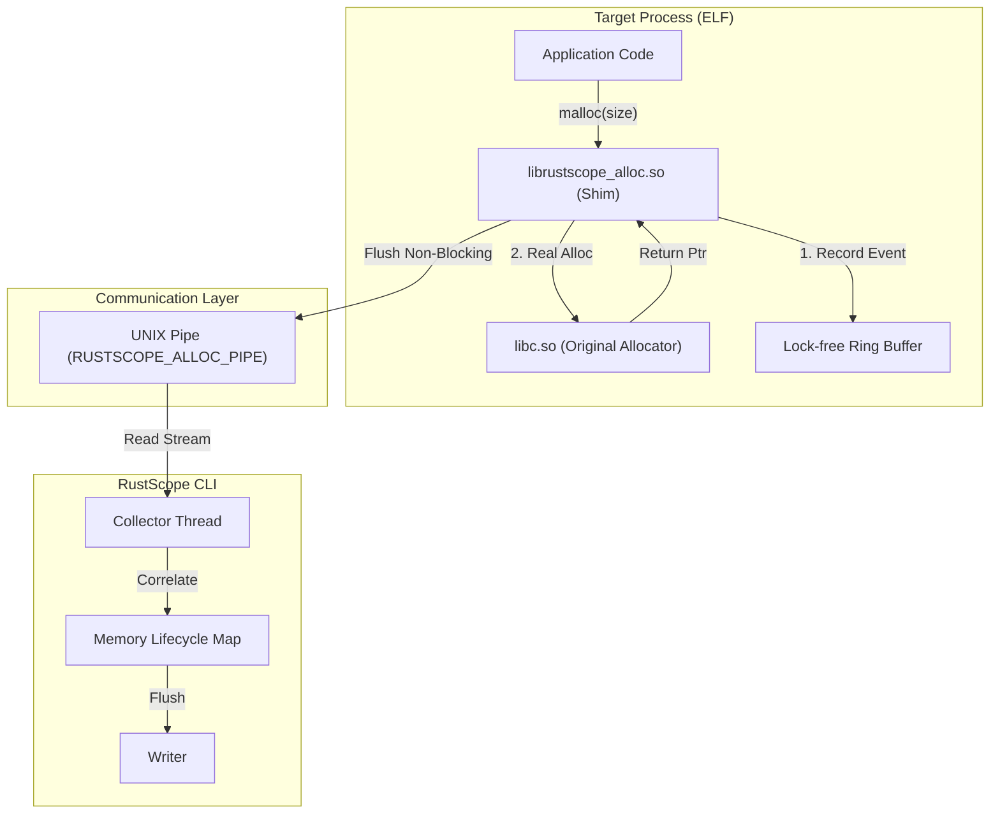

# RustScope v0.4.0 Release Notes

## Zero-Instrumentation Allocation Tracking (Linux)

**RustScope v0.4.0** marks a significant leap in our memory profiling strategy. We are moving beyond the requirement for internal library instrumentation to provide **system-wide allocation tracking** on Linux using an `LD_PRELOAD` shim.


---

### Key Features & Changes

#### 1. The `librustscope_alloc` Shim


We've introduced a low-overhead shared library (`librustscope_alloc.so`) that can be pre-loaded into any ELF process.

- **What it does**: Intercepts standard `libc` allocation symbols (`malloc`, `free`, `realloc`, `calloc`).
- **Why it matters**: You can now profile memory usage in binaries you didn't write, or in Rust projects that cannot easily change their `GlobalAlloc`.

#### 2. Data Flow Architecture (DFD)

The v0.4.0 architecture is designed for minimum interference with the target process while providing high-resolution data.



#### 3. Local-Pipe IPC Details

Communication between the shim and the `rustscope-cli` is handled via a high-performance UNIX named pipe.

- **Non-Blocking Strategy**: The shim uses a lock-free ring buffer. If the pipe is full, events are dropped to prevent target process stalling (visibility vs. stability trade-off).
- **Latency**: Sub-microsecond overhead per allocation event on the hot path.
- **Reliability**: Uses a dedicated background thread in the target process (optional) to flush data, keeping the `malloc` call extremely fast.

#### 4. Support for Foreign Binaries

Track heap usage in:

- Legacy Rust binaries (v1.50 or earlier).
- C/C++ applications.
- Multi-language environments (e.g., Python scripts calling Rust extensions).

#### 5. Integrated Lifecycle Mapping

The `rustscope-cli` now correlates these raw allocation events with process-level CPU/Thread data, providing a holistic view of memory churn even without function instrumentation.

---

### 🛠️ Operation Guide

To use the new allocator shim on Linux:

```bash
# Set the pipe path
export RUSTSCOPE_ALLOC_PIPE=/tmp/rustscope-alloc.pipe

# Run any binary with the shim
LD_PRELOAD=./target/release/librustscope_alloc.so ./my-app
```

---

### Roadmap Context

This release satisfies our goal of bringing **Linux Memory Parity** to the RustScope ecosystem, preparing the ground for v0.5.0, where we plan to add stack-trace unwinding to these allocation events.

---

**Status**: `In Development` (Alpha/Roadmap)
**Target Architecture**: Linux (x86_64, aarch64)
