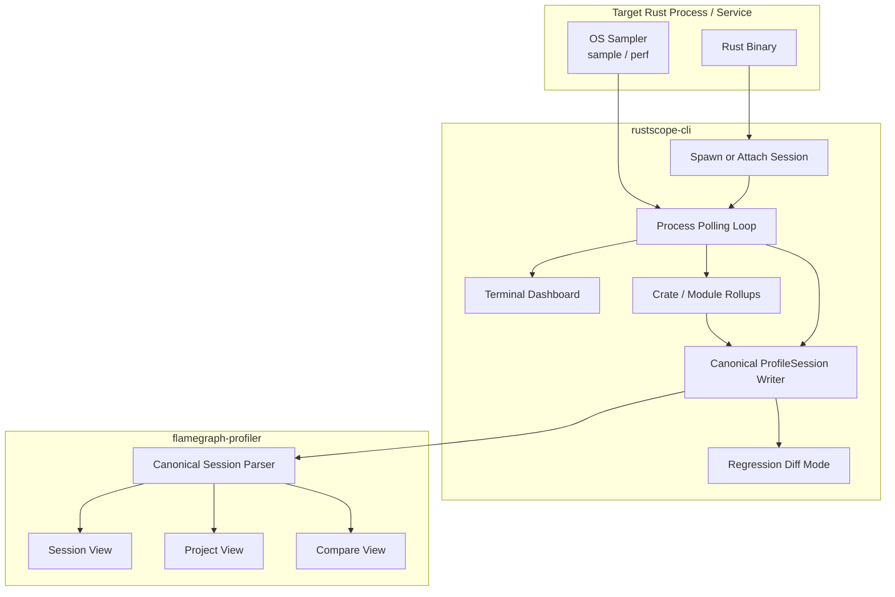

# RustScope v0.5.0 Release Notes

## Unified Session Profiling, Rollups, and Regression Workflow

**RustScope v0.5.0** turns the CLI, schema, and frontend into a more coherent product. The main shift in this release is that `rustscope-cli` now emits the same canonical `ProfileSession` shape used by the Rust library, while also adding long-running session profiling, project-level rollups, terminal dashboard improvements, and regression comparison workflows.


---

### Key Features & Changes

#### 1. Canonical CLI Output

The `rustscope-cli` no longer writes a separate legacy JSON shape as its primary output.

- **What changed**: `rustscope-last.json` is now emitted as a canonical `ProfileSession`.
- **What was added**: optional process/session fields such as `process_summary`, `process_samples`, `memory_events`, `crate_rollups`, and `module_rollups`.
- **Why it matters**: the library, CLI, and frontend now have one main session format instead of two competing schemas.

#### 2. Session Profiling for Real Processes

This release improves the CLI from a short-lived demo runner into a real session profiler.

- **Attach mode**: profile an already-running service with `--pid`.
- **Session lifecycle**: run until the process exits or the user stops the session.
- **Flush reliability**: the collector now waits for shutdown and writes the session report more reliably at the end of the run.

#### 3. Multi-Line Terminal Dashboard

The CLI now includes a real in-place terminal dashboard for live sessions.

- **Current metrics**: CPU, heap, threads, FDs, syscall rate.
- **Session peaks**: peak CPU, peak heap, peak threads, peak FD usage.
- **Event pane**: persistent recent event list instead of a single transient spike marker.
- **Modes**:
  - `compact`
  - `full`
  - faster/slower refresh modes
- **Controls**:
  - `q` stop session
  - `c` toggle compact mode
  - `s` slow refresh
  - `f` fast refresh

#### 4. Project-Level Rollups

RustScope now exposes project-level hotspot summaries instead of only raw function rows.

- **Crate rollups**: aggregate hotspot percentages by crate.
- **Module rollups**: aggregate hotspot percentages by module.
- **Session summary**: combine process-level and function-level data in one report.
- **Frontend support**: these rollups are now parsed and visualized directly.

#### 5. Frontend Product Views

The web UI now has clearer top-level analysis workflows.

- **Session View**: overview of process metrics, metadata, and event log.
- **Project View**: crate/module rollup views for whole-project analysis.
- **Compare View**: load a baseline session and inspect regressions, improvements, and new hotspots.

#### 6. Regression / CI Workflow

The CLI now supports session-to-session comparison as a first-class workflow.

```bash
rustscope \
  --compare-baseline baseline.json \
  --compare-current current.json \
  --compare-output rustscope-diff.json \
  --threshold 10 \
  --fail-on critical
```

- **What it does**: loads two canonical RustScope sessions and writes a structured diff.
- **Why it matters**: enables CI gating for performance regressions.
- **Fail modes**:
  - `any`
  - `minor`
  - `moderate`
  - `critical`

#### 7. Sampler Backend Progress

Sampling moved forward on both supported desktop platforms.

- **macOS**:
  - switched from a single long `sample` run to short chunked sampling with `-mayDie`
  - improved parser/fallback behavior so sessions do not come back empty
- **Linux**:
  - added a `perf record` / `perf script` function sampling path when `perf` is available

#### 8. Stress Demo Workload

A new `stress_demo` example was added to generate a realistic profile session.

- CPU bursts
- memory spikes
- thread bursts
- FD churn
- syscall-heavy file activity

This gives users a more reliable way to validate CLI output, JSON upload flow, and dashboard behavior end to end.

---

### Data Flow Architecture (Unified Session Path)



---

### 🛠️ Operation Guide

#### Install the CLI

```bash
cargo install --path rustscope-cli
```

#### Profile a Running Service Session

```bash
rustscope --pid 12345 --name my-api -v
```

#### Profile a Demo Workload

```bash
rustscope --cargo rustscope-examples --bin stress_demo -v
```

#### Compare Two Sessions

```bash
rustscope \
  --compare-baseline baseline.json \
  --compare-current current.json \
  --compare-output rustscope-diff.json \
  --threshold 10 \
  --fail-on critical
```

---

### Roadmap Context

This release is the product-cohesion milestone for RustScope.

- The CLI is now much closer to a real developer-facing profiler instead of a demo collector.
- The frontend understands canonical CLI sessions directly.
- Project-level analysis and regression workflows are now part of the core story.

This sets up the next major work:

- stronger macOS hotspot capture beyond `sample` limitations
- better Linux sampling quality and symbolization
- removal of remaining legacy compatibility branches
- deeper project/session analysis views in the frontend

---

### v0.5.0 Product Targets

The next meaningful version of RustScope should not just add more metrics. It should answer three questions reliably:

1. **Where did time go across the whole project?**
2. **What happened during this session window?**
3. **What changed versus baseline?**

The following features define that target.

#### 1. Time-Correlated Session Analysis

RustScope should record:

- process metrics over time
- stack hotspots over time
- crate/module/function rollups over time

The critical product outcome is correlation:

- click a memory spike
- inspect the exact time window
- see which crate, module, and function dominated that window

This is the feature that makes RustScope more than a profiler wrapper.

#### 2. Real Hotspot Capture

The highest-priority engineering goal is reliable hotspot capture on both macOS and Linux.

- **macOS target**:
  - improve symbol extraction from `sample`
  - handle short-lived processes and partial output better
  - reduce fallback-only sessions
- **Linux target**:
  - mature `perf` integration
  - improve symbolization and stack aggregation quality
  - support more reliable attach/session sampling flows

Success criteria:

- crate/module/function hotspots are real most of the time
- fallback hotspots are rare, not the normal path

#### 3. True Timeline / Session View

The session timeline should become the center of the UI.

- CPU lane
- memory lane
- FD lane
- thread lane
- syscall lane
- hotspot overlays
- event markers

And each event should support correlation:

- “memory spike happened while these crates/functions were hot”
- “thread count jumped while this subsystem dominated”

#### 4. Regression Engine as a First-Class Workflow

The compare engine should be treated as a core product feature, not a utility.

- support thresholds by:
  - mean
  - p95
  - p99
  - alloc growth
  - RSS growth
- emit machine-readable result JSON
- provide concise human summary for CI logs
- use stable exit codes for pipeline gating

This makes RustScope useful in CI, release validation, and performance budgeting.

#### 5. Project-Level Frontend Views

The frontend should feel like a product for project analysis, not just an uploaded JSON explorer.

- dedicated **Session** view
- dedicated **Project** view
- dedicated **Crate** view
- dedicated **Module** view
- dedicated **Function** drill-down
- drill-down path:
  - session -> crate -> module -> function -> event window

#### 6. One Stable Schema

The canonical `ProfileSession` should be frozen and versioned more deliberately.

- remove remaining legacy compatibility branches
- document required vs optional fields
- keep process/session extras inside the same stable schema
- avoid creating a second “CLI schema” again

This is required for:

- frontend stability
- CI workflows
- exports
- long-term backward compatibility

#### 7. Better Attach-to-Service Workflow

RustScope should feel natural for profiling real services.

- attach to a running process
- name the session
- tag it with metadata
- include build/environment information
- stop cleanly and flush a complete report

This makes RustScope usable in real dev and staging workflows, not just toy demos.

#### 8. Export / Interoperability

RustScope should not trap users inside its own viewer.

- native `pprof` export
- native speedscope export
- native Chrome trace export
- predictable JSON schema for automation

That keeps the product credible for teams that already use other tooling.

---

### Recommended v0.5.0 Execution Order

To avoid a broad but shallow release, the work should be sequenced like this:

1. **Reliable hotspot capture on macOS and Linux**
2. **Time-based session correlation**
3. **Timeline-driven frontend drill-down**
4. **Regression engine hardening for CI**
5. **Schema freeze and legacy cleanup**
6. **Export polishing**

If only one core feature defines v0.5.0, it should be:

> **Session Correlation**  
> Record process metrics over time, record hotspots over time, and let the user click a spike to see which crate/module/function dominated that exact window.

That is the feature most likely to make RustScope feel like a strong product instead of a collection of profiling pieces.

---

**Status**: `In Development`
**Target Platforms**: macOS, Linux
